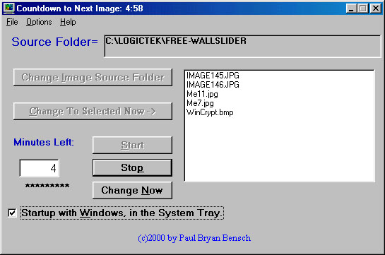



## YourChoice Wallpaper Slideshow

### Description

Wallslider is an Application that sits in your System Tray, and changes your desktop wallpaper when you want or automatically at the end of a timed interval.

The program changes the wallpaper to one of the Images (*.bmp or *.jpg) in the Source folder, that you Specify.

The Application will automatically change the wallpaper Images, sequentially (in alpha order) or in random order. various other options are available.

Program defaults to an Interval of 5 minutes and the folder for the current Source path is the Folder from which you Executed from.

* Wallpaper Style is either centered or Stretched.

Wallpaper Style is Under the Options Menu, and is checked for centered, not checked to be stretched.

When the Slideshow is activated options are not available for modification. Stop the Slideshow to modify your options.

The Wallpaper Slideshow Works on Both the Standard and the Active Desktops, and is fully compitable with Win9x, WinNT, WinME, and Win2K.

The Source Code, and Executable File, Contianed within this package, is Copyrighted, and MAY NOT be Reproduced, or Copied, without the Prior Written Consent of the Author, Paul Bryan Bensch.

Author Contact Info : Pbryan@SoftHome.net
 
### More Info
 

             |
---                |---
**Submitted On**   |2001-01-15 13:01:48
**By**             |[Pbryan](https://github.com/Planet-Source-Code/PSCIndex/blob/master/ByAuthor/pbryan.md)
**Level**          |Intermediate
**User Rating**    |4.5 (18 globes from 4 users)
**Compatibility**  |VB 6\.0
**Category**       |[Complete Applications](https://github.com/Planet-Source-Code/PSCIndex/blob/master/ByCategory/complete-applications__1-27.md)
**World**          |[Visual Basic](https://github.com/Planet-Source-Code/PSCIndex/blob/master/ByWorld/visual-basic.md)
**Archive File**   |[CODE\_UPLOAD137991152001\.zip](https://github.com/Planet-Source-Code/pbryan-yourchoice-wallpaper-slideshow__1-14438/archive/master.zip)

